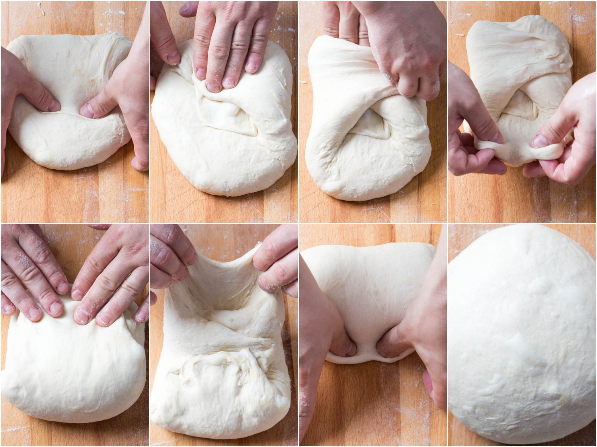
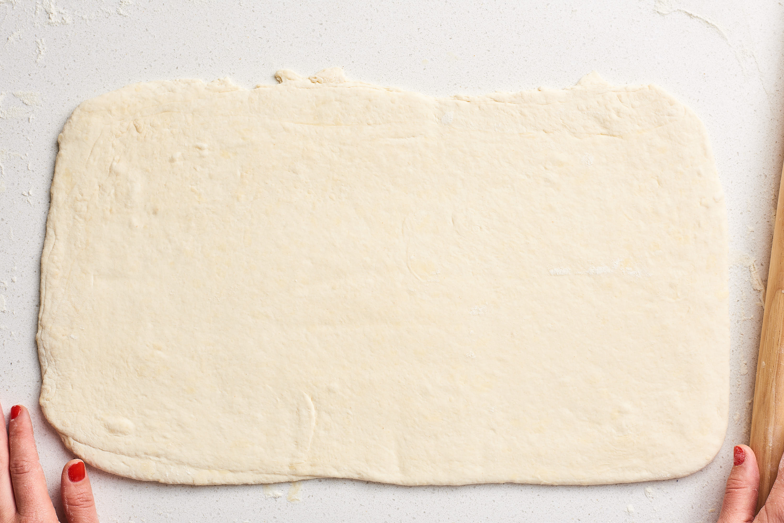
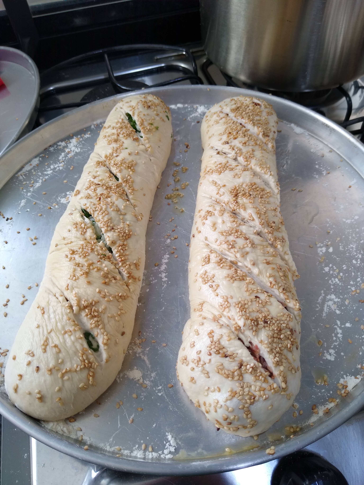
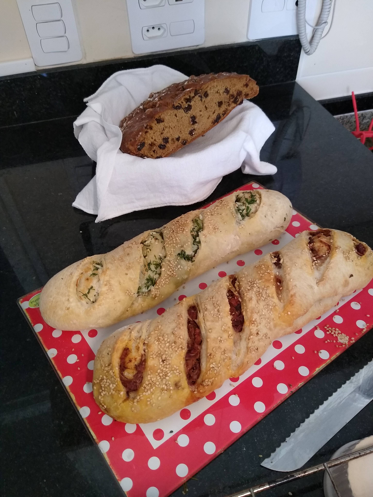

# Baguete Recheada

[Fotos](#Fotos)

## Ingredientes

### Massa

- 500 gramas de farinha de trigo comum sem fermento
- 10 gramas de sal (2%)
- 5 gramas de fermento biológico seco (meio pacotinho) (1%)
- 325 ml de água em temperatura ambiente (65%)

### Recheio

- 300 gramas de Qualquer recheio que não seja tão úmido

## Utensílios

- Tijela grande
- Tijela pequena
- Assadeira baixa (como as de Pizza, assim o pão assa por completo) ou forno com pedra refratária.
- Assadeira pequena (para colocar água)
- Espatula ou faca grande
- Balança de cozinha

## Preparo 

### Massa

#### Passo 1: massa base

Em uma tijela pequena coloque 100 ml de água, 50 gramas de farinha de trigo e 5 gramas de fermento,
misture levemente com uma colher até virar uma pasta e deixe descansar por 10 minutos.
(essa é a massa base que vai fazer o processo de fermentação, pode também usar 100 gramas de femento natural se tiver)

#### Passo 2: massa principal

Enquanto a massa base fermenta em uma tijela grande junte 450 gramas de farinha de trigo com 10 gramas de sal e misture bem.

Após os 10 minutos (quando a massa base começar a aumentar de tamanho ou formar pequenas bolhas de ar) misture essa massa com a farinha da tijela grande e vá completando com 225 ml de água.

> É importante atentar-se as medidas corretas pois este é um pão com 65% de hidratação exata!

Misture bem todos os ingredientes na tijela grande com a ajuda de uma espátula ou com as mãos até que a massa absorva toda a água e forme uma massa homogenea, tampe a tijela com um pano ou plástico e deixe descansar por mais 30 minutos.

#### Passo 3: Recheio

> Aproveite esses 30 minutos para ir preparando o recheio :) 
> Algumas sugestões: 
> - Tomates cereja picados, manjericão, pitadas de sal do himalaia
> - Azeitonas fatiadas 
> - Alecrim e azeite
> - Carne de Jaca
> - Escarola refogada (bem seca) com alho
> - Cebola picada com salsinha e azeite

#### Passo 4: Sovar ou Dobrar 

Depois de 30 minutos a massa já vai ter crescido um pouco e agora vamos fazer a sova (ou dobras) para liberar mais gluten, espalhe um pouco de farinha em um balcão ou tábua e despeje a massa.

Usando as mãos (ou espátula de padeiro) amasse bem ou faça dobras na massa repetidamente durante 10 minutos ou até que ela fique com uma textura bem lisa.

#### Passo 5: Montagem

Divida a massa em 3 partes iguais e usando um rolo, uma garrafa ou as mãos, abra cada parte da massa formando um retangulo (do tamanho de uma tábua de cozinha)

- Distribua o recheio uniformemente sobre a massa aberta deixando uma borda de +- 1 cm sem recheio.
- Enrole como se fosse fazer um rocambole.
- Com as mãos vá apertando a massa até dar o formato desejado (formato de filão ou baguete)
- Espalhe um pouco de farinha na assadeira
- Coloque os 3 filões já montados na assadeira
- Com a ajuda de uma peneira polvilhe uma fina camada de farinha de trigo por cima
- Ou se preferir coloque gergelim
- Cubra com um pano ou plástico e deixe descansar por mais 20 minutos

> Enquanto aguarda os 20 minutos, pré aqueça o forno em 250 graus.

#### Passo 6: Forno

Com o forno pré aquecido coloque na grade de baixo ou na base do forno uma assadeira pequena com água (não precisa ser muita água, apenas uns 2 dedos de água no fundo da assadeira). Essa água vai virar vapor e ajudar na fase de crescimento do pão.

> Caso o seu forno tenha a função de vapor pode usar ao invés do truque da assadeira com água. Caso tenha uma pedra refratária também não será necessário usar a água.

Remova o pano ou plástico da assadeira onde está o pão, usando uma faca afiada ou uma navalha faça a assinatura do pão, cortes finos na superficie da massa que servem para dar um visual bonito e também para permitir a entrada de mais ar.

Coloque os pães no forno (na grade acima da assadeira com água) na temperatura de 250 graus e deixe assar durante 25 minutos.

Após 25 minutos abaixe a temperatura para 200 graus (se tiver um grill essa é a hora de liga-lo) e deixe assar por mais 25 minutos ou até formar uma casca firme e dourada.

#### PAsso 7: Pós cozimento

Coloque os pães já assados sob uma grade ou dentro de uma cesta e deixe esfriar por 10 minutos dessa forma o pão termina o processo de cozimento depois de sair do forno.

## Fotos

