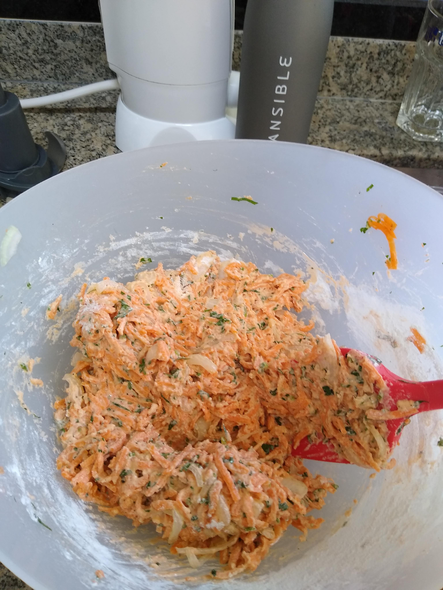
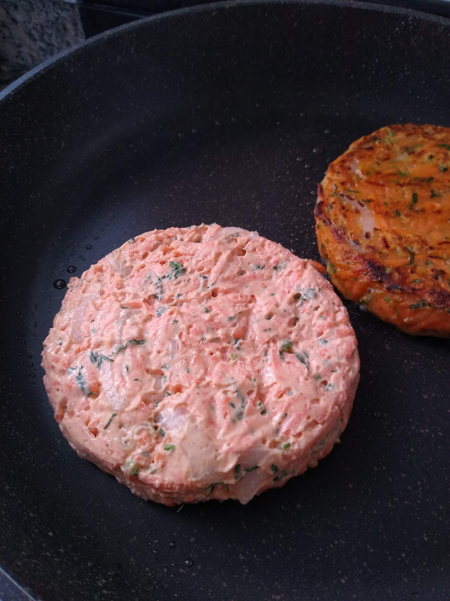
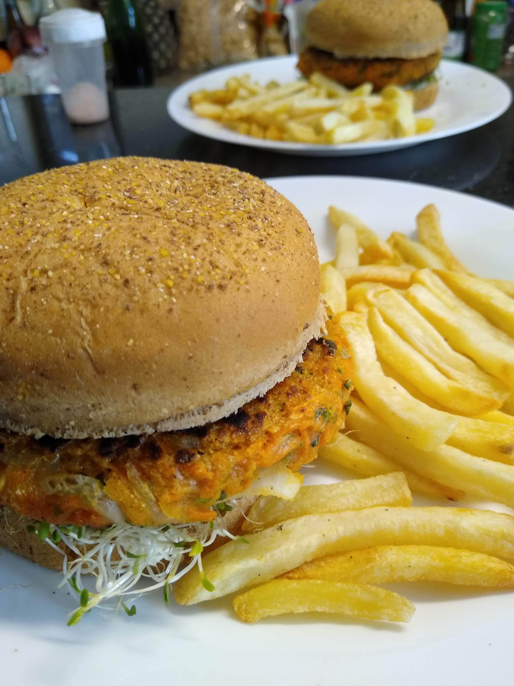

# Hamburguer de Cenoura com Alho e Ervas

[Fotos](#Fotos)

## Ingredientes

### hamburguer

- 600 grs de cenoura ralada
- 50 grs de cebola branca (1/2 cebola média) cortada em laminas
- 50 grs de salsinha picada
- 10 grs de alho em pó
- Pimenta do Reino a gosto
- Sal a gosto
- Farinha de trigo até dar o ponto.

### Para montagem (opcional)

- Pão de hamburguer
- Maionese Vegana ou Avocado amassado
- Broto de Alfafa ou Rucula
- Molho Barbecue

## Utensílios

- Ralador de Cenoura
- Plástico para alimentos (pode ser um daqueles sacos de congelar)
- Balança, medidor ou um bom olhometro
- Modelador de hamburguer, uma boa tampa de pote ou talento manual :)
- Frigideira antiaderente

## Preparo 

### Massa

Em uma tijela (uso uma bacia bem grande) coloque a cenoura ralada
Coloque sal sobre a cenoura e misture (coloquei 2 colheres de chá)
Misture e deixe a cenoura absorver o sal (a cenoura vai diminuir o volume)

Coloque as laminas de cebola, a salsinha, o alho em pó e a pimenta do reino a gosto (usei 2 pitadas leves) e misture bem.

Vá adicionando a farinha de trigo colher por colher e misturando (com a mão mesmo) até ficar com a **textura de hamburguer**

> **Textura de Hamburguer**: é quando vc forma uma pequena bola com a massa na palma da mão e amassa como se fosse formar um hamburguer e a massa não racha e você consegue segurar por uma das pontas da massa sem que ela despedace.

### Modelagem 

Forme 4 bolas com a massa 
Em uma mesa ou balcão coloque o plástico para alimentos
Coloque a bola de massa sobre metade do plastico e cubra com a outra metade
Usando um modelador de hamburguer ou uma tampa de pote modele o hamburguer
Remova o plástico caso vá levar o hamburguer direto a frigideira
Deixe com o plástico em caso de congelamento

### Montagem

Em uma frigideira anti-aderente com um fio de azeite frite os hamburgueres dos 2 lados até ficarem dourados

Corte o pão e passe maionese caprichadamente dos 2 lados
Na parte inferior do pão coloque broto de alfafa ou rucula picada
Coloque o hamburguer já frito e finalize.

## Créditos

Baseado no curso de Hamburgueres do Chef A. Viland.

## Fotos

