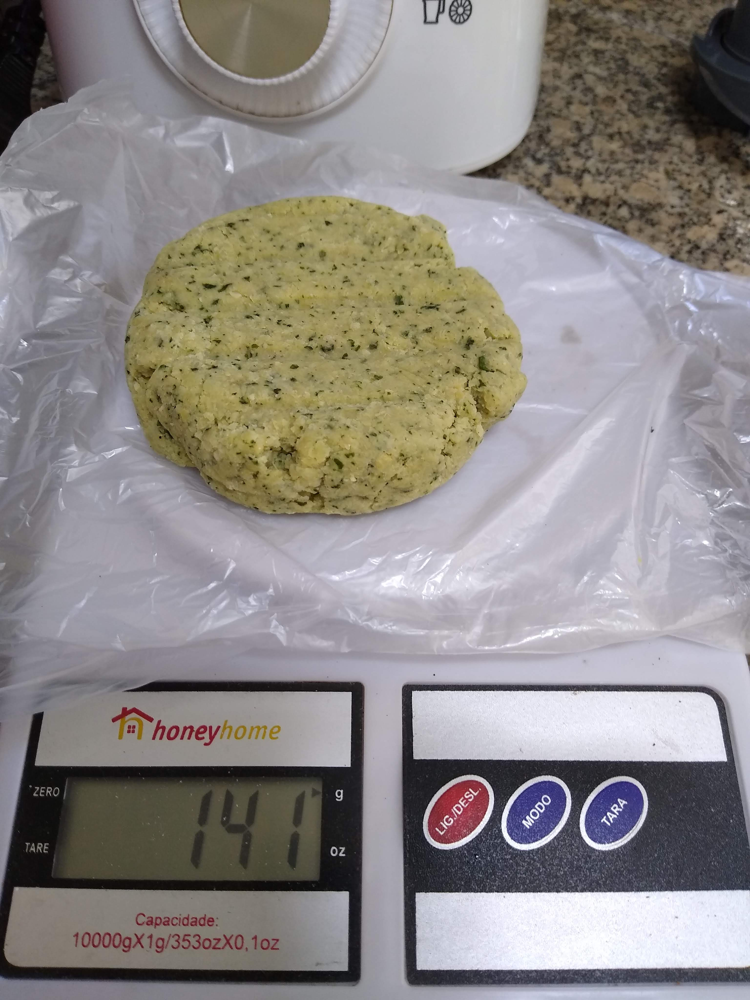
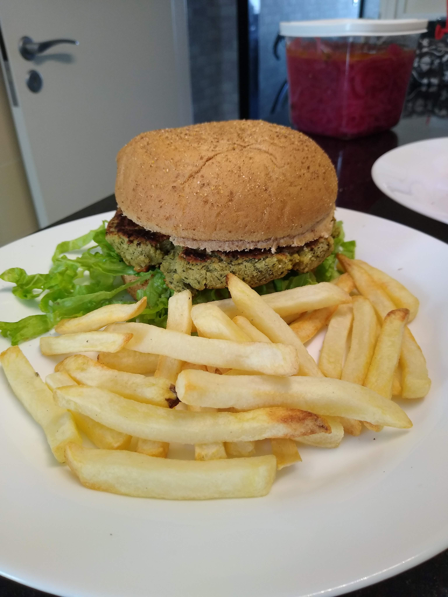

# Hamburguer de Grão de Bico

[Fotos](#Fotos)

## Ingredientes

### hamburguer

- 400 grs de grão de bico cozido
- 80 grs de cebola branca (1 cebola média cortada em 4)
- 50 grs de Coentro picado (ou Salsinha picada se preferir) - usei só as folhas de um maço inteiro
- 30 ml de oléo vegetal (usei de girassol, 30ml = 2 colheres de sopa cheias)
- Sal a gosto (usei 3 pitadas de mão cheia)
- Pimenta do reino a gosto (usei uma pitada caprichada)
- Farinha de Mandioca até dar o ponto.

### Para montagem (opcional)

- Pão de hamburguer
- Maionese Vegana ou Avocado amassado
- Alface crespa picada
- Picles de cebola roxa [(receita aqui)](./Picles de Cebola.md)

## Utensílios

- Processador de alimentos
- Plástico para alimentos (pode ser um daqueles sacos de congelar)
- Medidor de ml ou colher
- Balança, medidor ou um bom olhometro
- Modelador de hamburguer, uma boa tampa de pote ou talento manual :)
- Frigideira antiaderente

## Preparo 

### Massa

No processador misture o **grão de bico**, a **cebola**, o **coentro**, o **oleo**, o **sal** e a **pimenta do reino**.

Após a massa ficar bem misturada (sem muitos pedaços inteiros, mas não a ponto de liquidificar, com **textura de massa**), remova a lamina do processador ou mova a massa para um outro recipiente.

Vá adicionando a farinha de mandioca colher por colher e misturando até ficar com a **textura de hamburguer**

> **Textura de Hamburguer**: é quando vc forma uma pequena bola com a massa na palma da mão e amassa como se fosse formar um hamburguer e a massa não racha e você consegue segurar por uma das pontas da massa sem que ela despedace.

### Modelagem 

Forme 4 bolas com a massa 
Em uma mesa ou balcão coloque o plástico para alimentos
Coloque a bola de massa sobre metade do plastico e cubra com a outra metade
Usando um modelador de hamburguer ou uma tampa de pote modele o hamburguer
Remova o plástico caso vá levar o hamburguer direto a frigideira
Deixe com o plástico em caso de congelamento

### Montagem

Em uma frigideira anti-aderente com um fio de azeite frite os hamburgueres dos 2 lados até ficarem dourados

Corte o pão e passe maionese caprichadamente dos 2 lados
Na parte inferior do pão coloque **picles de cebola** e alface crespa
Coloque o hamburguer já frito e finalize.

## Créditos

Baseado no curso de Hamburgueres do Chef A. Viland.

## Fotos

