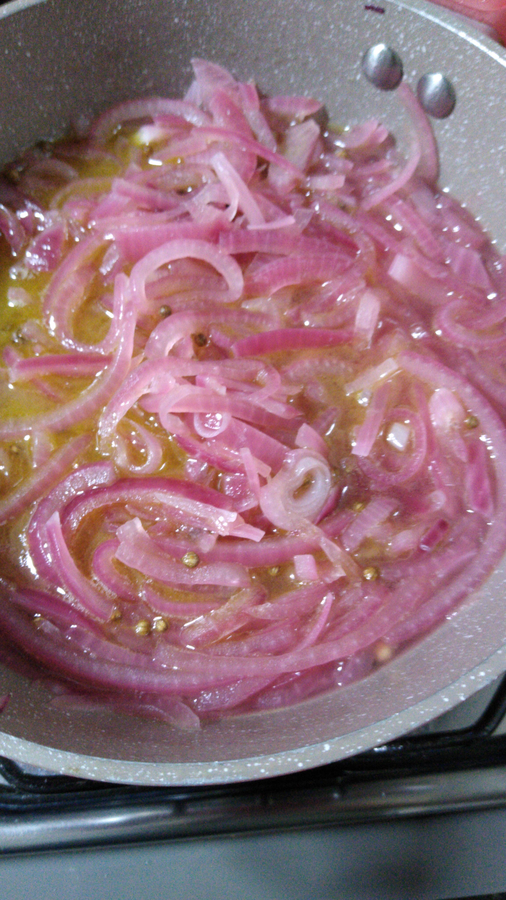

# Picles de Cebola

[Fotos](#Fotos)

## Ingredientes

- 200 ml de água
- 200 ml de vinagre (usei o de maça)
- Sal a gosto
- 4 colheres rasas de açucar refinado
- 3 cebolas roxas médias cortadas em lâminas
- Coentro em grãos
- Pimenta do Reino em Grãos
- 1 colher de sopa de azeite

## Utensílios

- panela
- recipiente de vidro

## Preparo 

Corte as cebolas em laminas finas
Em um panela coloque a água, o vinagre, sal, açucar e azeite em fogo alto
Assim que levantar fervura abaixe o fogo e acrescente as cebolas, uma colher de chá rasa de coentro em grão e uma colher de chá rasa de pimenta do reino em grão
Cozinhe por 2 minutos
Deixe esfriar
Coloque em um pote de vidro e guarde

### Consumo

Consuma somente após 24 horas do preparo para a cebola pegar o sabor dos temperos
Utilize em [hamburgueres](./Hamburguer de Grao de Bico.md) ou misture am grãos para fazer uma salada.

## Fotos

